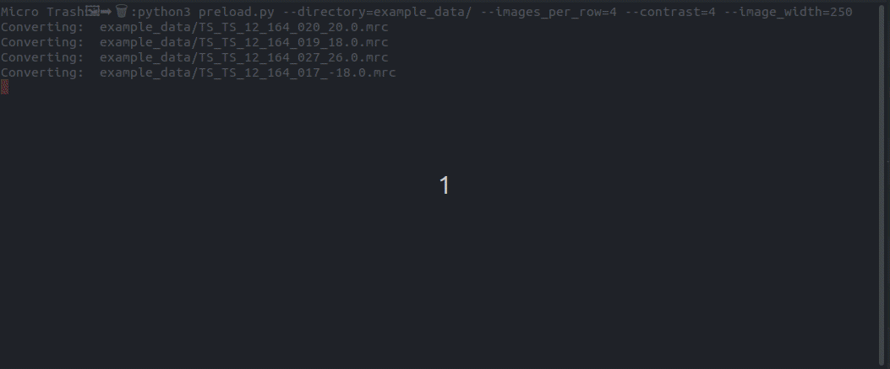
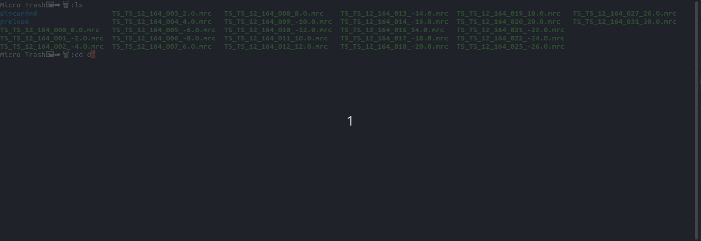

# Micrograph Trasher 🖼➡🗑

## Description

*Micro Trasher 🖼➡🗑* allows to preview MRC file in an easily accessible GUI in which the bad micrographs can be moved to another folder by clicking on them. With this, you can easily decide whether the micrographs you generated are trash or not!

Invocation from the command line:



The window from *Micro Trasher 🖼➡🗑* pops up after the covnersion and faulty micrographs can be selected by clicking on them.


The resulting discarded files can be found in the ```discarded/``` folder:



## Installation

### Dependencies


For Linux-based operating systems, the tkinter (GUI) library needs to be installed extra (e.g. for Debian based systems):

```
sudo apt install python3-tk -y
```

If you are using it in an environment where you do not have root privileges (e.g. a HPC environment) contact your administrator to install it for you.

For using it on the ISTA cluster, some python versions have tkinter installed and some do not. Versions which worked, as of now (21.09.22): 3.10.1, 3.10.4, 3.10.6, 3.9.9, 3.9.13

Clone the git repository or install via pip:

```
pip3 install git+https://git.ist.ac.at/bsinger/microprev.git
```

Invoke the program with:

```
python3 -m micro_trasher --directory </directory/with/MRC files>
```

The other possible parameters are:

``` 
microtrasher.py [-h] [--images_per_row IMAGES_PER_ROW] [--directory DIRECTORY] [--contrast CONTRAST] [--brightness BRIGHTNESS]
                  [--image_width IMAGE_WIDTH]

Micrograph Selection Pipeline

options:
  -h, --help            show this help message and exit
  --images_per_row IMAGES_PER_ROW
                        Number of images displayed per row
  --directory DIRECTORY
                        Directory of the MRC files
  --contrast CONTRAST   Contrast for the MRC files
  --brightness BRIGHTNESS
                        Value to add for the brightness
  --image_width IMAGE_WIDTH
                        Width of each image to be displayed
```
 
NOTE: To find the best contrast and brightness, several invokations might be necessary